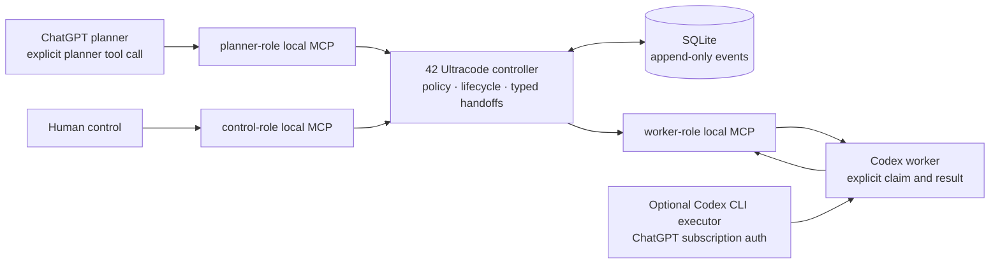

# 42 Ultracode

Subscription-native orchestration for disciplined iterative ChatGPT + Codex
engineering workflows.

ChatGPT plans. Codex executes. Humans currently shuttle prompts between them.
42 Ultracode closes that loop with typed handoffs, controller-owned workflow
state, and evidence that survives a restart.

> **Experimental / early dogfood.** v0.1 is intentionally a small, local,
> single-user system. It is not a general multi-agent framework.

## Why it exists

Existing agent frameworks commonly assume API credentials and make the model
both the planner and the source of workflow truth. 42 Ultracode is for a
different starting point: a developer already has ChatGPT and Codex
subscription sessions and wants their engineering loop to be disciplined
without copying a planning prompt into Codex and pasting a raw Codex transcript
back again.

The controller owns lifecycle, iteration bounds, policy, and immutable event
history. ChatGPT retains planning, critique, and judgment. Codex retains
repository execution. Neither model gets authority to rewrite the controller's
rules.

## Current status

The demonstrated cross-surface level is **Level C: shared state with explicit
invocation on both sides**.

- A local role-scoped MCP server carries typed instructions and results through
  the controller's SQLite database.
- A planner explicitly calls its planner tools; a Codex worker explicitly calls
  its worker tools. This eliminates copying handoff contents when the local MCP
  surface is available, but it does not eliminate the explicit decision to
  continue a run.
- An optional Codex CLI adapter can execute a claimed instruction using an
  existing ChatGPT-authenticated Codex session. It does not make arbitrary
  ChatGPT thread continuation automatic.
- No supported automatic ChatGPT Chat ↔ Codex thread-continuation primitive was
  demonstrated. v0.1 does not use GUI automation, screen scraping, or
  undocumented message injection to pretend otherwise.

The subscription spike verified a read-only `codex exec` turn under a ChatGPT
login and without an OpenAI API key. In the environment used for that spike,
`gpt-5.5` was compatible; the installed CLI's configured `gpt-5.6-terra`
default required a newer Codex version. See the
[architecture decision](docs/decisions/0001-v01-local-subscription-transport.md)
and [validation guide](docs/VALIDATION.md) for the exact boundary and how to
repeat the check.

## Architecture



The controller maintains a deliberately small state machine:

```text
NEW → PLANNING → READY_FOR_CODEX → CODEX_RUNNING → CODEX_COMPLETE → REVIEWING
                                                           ├→ READY_FOR_CODEX
                                                           ├→ HUMAN_REQUIRED
                                                           ├→ FAILED
                                                           └→ COMPLETE

any non-terminal state → PAUSED → prior safe state
any non-terminal state → STOPPED
```

Each meaningful change appends an ordered event. Replay is the canonical source
of current state, so a controller restart does not depend on an in-memory model
narrative.

## v0.1

The internal loop provides:

- bounded runs and controller-enforced iteration ceilings;
- instructions with `goal`, `context`, `constraints`, and `done_when`;
- structured executor results with evidence, changed files, tests, commands,
  blockers, questions, uncertainty, and a recommended next action;
- one-worker turn leases, idempotency keys, pause/resume/stop, and human
  escalation;
- SQLite append-only persistence and deterministic replay; and
- separate planner, worker, and control MCP capability surfaces.

The exact local tool contract is in
[`specs/001-internal-loop/contracts/mcp-tools.md`](specs/001-internal-loop/contracts/mcp-tools.md).

## Skills and engineering discipline

The engine transports work; Skills define how it is carried out. Repository
Skills are available under [`.agents/skills`](.agents/skills):

- `ultracode-planner` turns an approved objective or result into the next
  bounded instruction, escalation, or evidence-backed completion.
- `ultracode-worker` claims work, stays within its constraints, validates it,
  and reports an evidence-rich result without silently changing the objective.
- `ultracode-control` supports status, history, pause, resume, and stop.

Spec Kit, iterative experimentation, security review, and test discipline can
be selected as discipline Skills. A future Ponytail discipline remains a
placeholder until its methodology is explicitly defined. External adversarial
review is a **v0.2** topic and is not present in the v0.1 runtime.

## Quick start

Prerequisites:

- Python 3.11 or newer;
- [`uv`](https://docs.astral.sh/uv/) for the repository commands below; and
- a ChatGPT-authenticated Codex CLI only for optional subscription/executor
  validation. The core controller does not need an OpenAI API key.

From the repository root:

```sh
uv sync --all-groups --no-editable
uv run --no-editable ruff format --check .
uv run --no-editable ruff check .
uv run --no-editable mypy ultracode
uv run --no-editable pytest
```

Exercise the local MCP server against a shared database in separate terminals:

```sh
uv run --no-editable ultracode mcp --role planner --database .ultracode/demo.db
uv run --no-editable ultracode mcp --role worker --database .ultracode/demo.db
uv run --no-editable ultracode mcp --role control --database .ultracode/demo.db
```

Each process exposes only the tools for its declared role. Configure a client
with only the role it needs; see [`.codex/config.toml.example`](.codex/config.toml.example)
and the [desktop validation procedure](docs/VALIDATION.md#plugin--desktop-validation).

To test the repository-local Codex plugin scaffold, which changes your personal
Codex plugin configuration, run:

```sh
codex plugin marketplace add "$PWD" --json
codex plugin add 42-ultracode@personal --json
codex plugin list --json
```

This verifies marketplace and manifest ingestion only. Installed plugins are
copied to a cache and cannot safely infer the path to this checkout, so the
plugin deliberately does **not** start the controller. Configure exactly one
role-specific local MCP entry using
[`.codex/config.toml.example`](.codex/config.toml.example) or the
[plugin setup note](plugins/42-ultracode/README.md). The authoritative
repository Skills remain under `.agents/skills`; plugin installation does not
establish automatic ChatGPT continuation.

To run the scripted local dogfood harness:

```sh
uv run --no-editable ultracode dogfood \
  --database .ultracode/dogfood.db \
  --evidence .ultracode/dogfood-evidence.json
```

The harness records its run ID, events, state transitions, restart check, and
manual-intervention accounting in the evidence file. Read
[`docs/DOGFOOD.md`](docs/DOGFOOD.md) before treating a harness result as a
cross-surface product claim. A sanitized executed record is retained at
[`docs/dogfood/2026-08-14-v01-evidence.json`](docs/dogfood/2026-08-14-v01-evidence.json).

The `--no-editable` setup flag is intentional: it keeps the console entry point
reproducible in the validated environment, including checkouts whose path
contains spaces. Use the same flag after dependency or packaging changes.

## Safety and trust boundaries

- Planner and worker payloads are untrusted input. The controller validates
  schemas, transition legality, relative paths, idempotency, and active leases.
- Worker-reported commands are evidence; the controller never executes them.
- Recognizable secrets are redacted before event persistence. Do not put
  credentials in objectives, instructions, results, or evidence.
- MCP role separation is capability hygiene on a trusted local machine, not
  multi-user authentication. Do not configure every role in one agent by
  default.
- SQLite events are append-only and tamper-evident under the stated local trust
  assumptions. A host administrator can replace a database; filesystem
  permissions and backups remain the operator's responsibility.
- Dangerous repository operations require a human approval boundary. v0.1 does
  not grant a model authority to increase limits, alter policy, rewrite history,
  or restart a terminal run.

## Validation

Run the full command set in [Quick start](#quick-start). The durable validation
plan separates unit, integration, subscription, desktop/plugin, dogfood,
failure, and security validation in [`docs/VALIDATION.md`](docs/VALIDATION.md).
The v0.1 feature specification, data model, and replay requirements are under
[`specs/001-internal-loop`](specs/001-internal-loop).

## Roadmap

- **0.1 — internal loop:** local, subscription-native ChatGPT/Codex handoffs;
  durable controller state; deterministic replay; role-scoped MCP; dogfood.
- **0.2 — external adversarial specialists:** possible Claude CLI, Grok CLI,
  Gemini CLI, agy, and local-model specialists behind the stable v0.1 core.
  None are implemented or invoked by v0.1.

## Contributing

This repository uses Spec Kit artifacts as the source of truth for feature
intent. Read [`AGENTS.md`](AGENTS.md), the
[Constitution](.specify/memory/constitution.md), and the active feature
specification before changing behavior. Keep changes small, add evidence-rich
tests, update relevant documentation, and run the full validation suite before
opening a review.

## License

No software license has been selected yet. Licensing is an explicit pre-release
decision; do not infer a license from the repository's public visibility.
